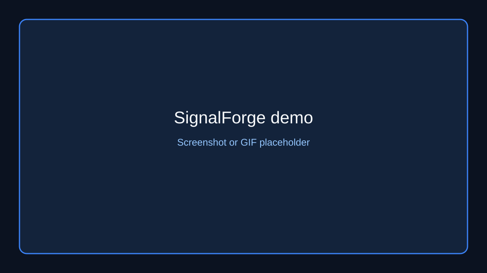
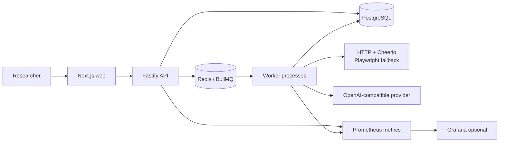

# SignalForge

SignalForge is an open-source, source-attributed AI research pipeline that turns
a natural-language question and explicitly permitted public URLs into validated,
deduplicated, scored records with supporting evidence.



The image is a placeholder for a future product screenshot or short demo GIF.

## Problem

Research teams often spend hours opening pages, copying claims into
spreadsheets, checking duplicates, and losing the evidence behind a result.
SignalForge provides a repeatable backend workflow with bounded fetching,
schema-validated LLM extraction, deterministic normalization, source
attribution, and partial success when individual sources fail.

## Architecture



Deployable applications are in `apps/api`, `apps/worker`, and `apps/web`. Shared
boundaries are in `packages/config`, `database`, `extraction`, `llm`,
`observability`, `queue`, `record-processing`, and `schemas`.

## End-to-end workflow

1. The API validates a query, extraction contract, source URLs, and optional
   idempotency key.
2. PostgreSQL persists the research job and one source placeholder per URL.
3. BullMQ receives a deterministic orchestration job; the API never scrapes or
   calls the LLM inline.
4. Workers fetch robots.txt and each submitted URL with DNS/IP SSRF controls,
   rate limits, timeouts, redirect limits, and response-size limits.
5. Cheerio extracts readable HTML first. Playwright is used only when static
   content is insufficient, with downloads and browser routes blocked.
6. Bounded text chunks are sent to an OpenAI-compatible provider as untrusted
   source data. Zod, evidence, source URL, and mention checks reject unsupported
   output before persistence.
7. Records are normalized, deterministically deduplicated, conflict-flagged, and
   assigned an explainable relevance score.
8. PostgreSQL stores results, evidence, source attribution, progress events,
   usage metadata, and terminal source outcomes. The API exposes status/results.

## Technology choices

- Node.js 22 and strict TypeScript provide a supported, typed runtime boundary.
- Fastify provides a small HTTP surface, structured logging, rate limiting, and
  OpenAPI documentation.
- PostgreSQL + Prisma provide transactions, foreign keys, JSONB, and indexed
  research state.
- Redis + BullMQ provide retries, exponential backoff, deterministic IDs,
  stalled-job recovery, and independent worker scaling.
- Cheerio is the inexpensive default parser; Playwright is an explicitly bounded
  fallback for JavaScript-heavy pages.
- OpenAI-compatible providers are isolated behind an LLM interface, so provider
  credentials and implementation details stay out of domain code.
- Zod validates external input, queue contracts, environment variables, and LLM
  output at runtime.
- Pino and Prometheus-compatible metrics support operational debugging without
  logging source text or credentials.

## Reliability characteristics

- API and workers are separate processes and scale independently.
- Queue jobs have bounded attempts, exponential backoff, timeouts, retention,
  stalled-job recovery, dead-letter context, and graceful shutdown.
- Source failures are isolated; jobs can complete partially.
- Database progress updates are transactional and repository-mediated.
- Deterministic job IDs prevent duplicate processing after restarts.
- Per-domain and global fetch concurrency, request delays, body limits, and
  total timeouts are configurable.
- Worker heartbeats and API/worker readiness probes cover PostgreSQL, Redis, and
  worker availability.

## Security boundaries

Only explicitly submitted public HTTP(S) URLs are in scope. URL normalization,
DNS resolution, private/link-local/metadata blocking, pinned HTTP lookups, and
redirect revalidation reduce SSRF risk. Webpage text is untrusted prompt data;
the LLM must return evidence tied to the supplied source and output is rejected
unless schema checks pass. Logs redact API keys, authorization, cookies,
passwords, tokens, and connection URLs. Docker runtime images use non-root users
and secrets are environment-injected.

The MVP intentionally has no authentication or authorization. Deploy behind an
authenticated gateway before exposing it to untrusted users. See
[`SECURITY.md`](SECURITY.md) and
[`docs/security-review.md`](docs/security-review.md).

## API example

Create a job:

```bash
curl -X POST http://localhost:3000/api/v1/research-jobs \
  -H 'content-type: application/json' \
  -H 'Idempotency-Key: demo-company-hiring-001' \
  --data @docs/sample-data.json
```

Request body:

```json
{
  "query": "Find Nigerian fintech companies currently hiring backend engineers",
  "sources": ["https://example.com/jobs"],
  "schema": {
    "type": "companyHiringSignal",
    "fields": [
      "company",
      "website",
      "role",
      "location",
      "signal",
      "sourceUrl",
      "evidence"
    ]
  }
}
```

The `202 Accepted` response is:

```json
{
  "data": {
    "id": "00000000-0000-4000-8000-000000000001",
    "status": "QUEUED",
    "createdAt": "2026-07-17T12:00:00.000Z",
    "statusUrl": "/api/v1/research-jobs/00000000-0000-4000-8000-000000000001"
  },
  "requestId": "07883774-668f-449c-a84a-bc35fcf8e588"
}
```

Use `GET /api/v1/research-jobs/:jobId`,
`GET /api/v1/research-jobs/:jobId/results?page=1&limit=20`, and
`POST /api/v1/research-jobs/:jobId/retry`. OpenAPI is available at `/docs`;
liveness, readiness, and Prometheus metrics are at `/health/live`,
`/health/ready`, and `/metrics`.

## Local development

Prerequisites: Node.js 22, pnpm 10, Docker Compose, and (for browser fallback)
the Playwright Chromium binary.

```bash
corepack enable
corepack prepare pnpm@10.12.1 --activate
cp .env.example .env
pnpm install --frozen-lockfile
pnpm --filter @signalforge/extraction exec playwright install chromium
docker compose up -d postgres redis
pnpm db:migrate:deploy
pnpm db:seed
```

Start the API, worker, and web app in separate terminals:

```bash
pnpm --filter @signalforge/api dev
pnpm --filter @signalforge/worker dev
pnpm --filter @signalforge/web dev
```

Open `http://localhost:3001`. For the full container stack use
`docker compose --profile migrate run --rm migrate` followed by
`docker compose up --build`. Add `--profile observability` for Prometheus and
Grafana. Test-only PostgreSQL and Redis services use `--profile test`.

## Testing

```bash
pnpm format:check
pnpm lint
pnpm typecheck
pnpm test
pnpm test:integration
pnpm build
pnpm audit --audit-level=high
```

Integration tests require the isolated test services and never use the
development database. CI also builds all three Docker images and validates
Compose configuration. The shell examples are in
[`docs/curl-examples.sh`](docs/curl-examples.sh); an importable Postman
collection is in
[`docs/postman/SignalForge.postman_collection.json`](docs/postman/SignalForge.postman_collection.json).

## Deployment architecture

The cost-conscious AWS shape is Route 53 + ACM + Application Load Balancer in
front of ECS Fargate API/web services, with an independently scaling worker
service. RDS PostgreSQL stores durable state, ElastiCache Redis runs BullMQ,
CloudWatch receives logs/alarms, and Secrets Manager or Parameter Store injects
credentials. Keep data services and tasks private; expose only the ALB. Run
Prisma migrations as an explicit one-off release task before deploying API and
workers. See [`docs/deployment.md`](docs/deployment.md) and
[`docs/environment.md`](docs/environment.md).

## Known limitations

- No authentication, authorization, tenancy, or user quota system.
- Explicit-source-only MVP; no broad crawling or discovery.
- Extraction supports HTML/plain text and can still fail on difficult pages.
- Playwright increases worker image size and resource usage.
- LLM quality, latency, availability, and cost depend on the configured
  provider.
- CSV export currently represents the loaded results page.
- Redis and PostgreSQL require production network isolation and credential
  management.
- The current dependency audit reports two moderate advisories.

## Future improvements

- Add identity, tenant isolation, quotas, and per-user job authorization.
- Add provider allowlists, richer source credibility metadata, and cost budgets.
- Add durable crawl/discovery only after a separate legal and security review.
- Add complete paginated export jobs and richer result filtering.
- Add managed AWS deployment automation and disaster-recovery exercises.
- Expand integration, browser, load, and adversarial security testing.

## Ethical web-extraction policy

SignalForge fetches only public pages explicitly supplied by the user. It does
not bypass authentication, paywalls, CAPTCHAs, anti-bot controls, or platform
restrictions; it respects robots.txt where applicable; it avoids sensitive
personal data; and it identifies itself with a clear user-agent. Rate limits,
bounded concurrency, response limits, and request timeouts protect both the
service and source sites. Users are responsible for ensuring their research
purpose and submitted sources comply with applicable law and terms of service.

## Project governance

See [`CONTRIBUTING.md`](CONTRIBUTING.md),
[`CODE_OF_CONDUCT.md`](CODE_OF_CONDUCT.md), [`SECURITY.md`](SECURITY.md), and
the architecture decision records in [`docs/adr`](docs/adr). The repository is
released under the ISC license shown in [`LICENSE`](LICENSE), matching the
existing package metadata.
