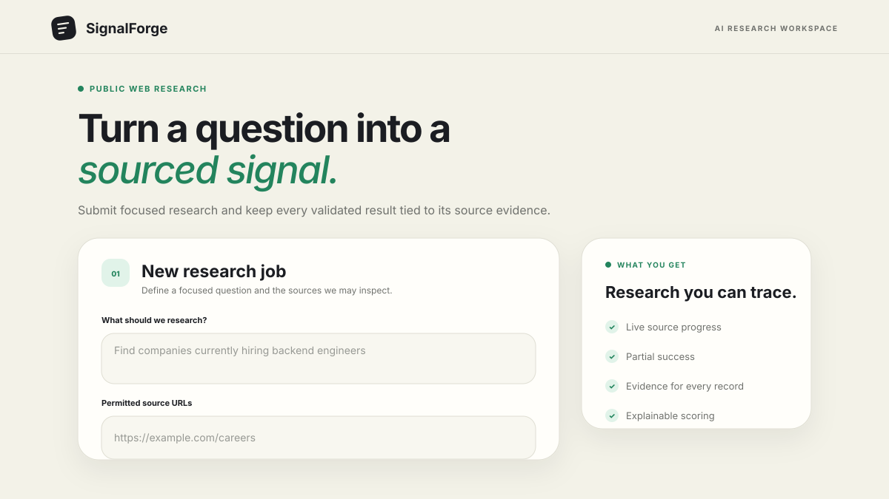
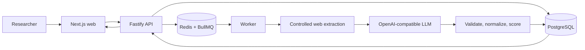

# SignalForge

> Turn focused research questions and explicitly permitted public URLs into
> validated, deduplicated, evidence-backed signals.

[](https://nodejs.org/)
[](https://pnpm.io/)
[](https://www.typescriptlang.org/)
[](LICENSE)
[](CONTRIBUTING.md)

SignalForge is an open-source, production-minded AI research pipeline. It
accepts a natural-language question and a bounded list of public sources,
processes them asynchronously, and returns structured records with evidence,
source attribution, confidence, and relevance scores.

The project is an early-stage MVP. The core pipeline works, the boundaries are
deliberately small, and contributors are welcome across frontend, backend,
extraction, data processing, testing, documentation, security, and operations.



## Why SignalForge?

Research teams often spend hours opening pages, copying claims into
spreadsheets, checking duplicates, and later discovering that the evidence
behind a result has been lost. SignalForge makes that workflow repeatable:

- only URLs explicitly supplied by the user are fetched;
- slow work runs outside the HTTP request lifecycle;
- extracted data is validated before it reaches the database;
- every result keeps its source and supporting evidence;
- deterministic normalization and deduplication reduce repeated records;
- one failed source does not discard successful results from other sources;
- queue, LLM, fetch, and health metrics make the pipeline observable.

## Start here

If this is your first visit, choose the path that matches your goal:

| I want to…                        | Start with…                                                     |
| --------------------------------- | --------------------------------------------------------------- |
| Run SignalForge locally           | [Quick start](#quick-start)                                     |
| Understand the repository         | [Codebase tour](docs/codebase-tour.md)                          |
| Make my first contribution        | [Contributing guide](CONTRIBUTING.md)                           |
| Configure a local environment     | [Local development guide](docs/local-development.md)            |
| Explore or call the API           | [API workflow](#try-the-api) or `http://localhost:3000/docs`    |
| Understand an architecture choice | [Architecture decisions](docs/adr)                              |
| Review security boundaries        | [Security policy](SECURITY.md)                                  |
| Deploy or operate the stack       | [Deployment](docs/deployment.md) and [runbook](docs/runbook.md) |
| Find all project documentation    | [Documentation index](docs/README.md)                           |

## Quick start

### Prerequisites

- [Node.js 22](https://nodejs.org/)
- [pnpm 10](https://pnpm.io/installation) through Corepack
- [Docker Desktop](https://www.docker.com/products/docker-desktop/) or Docker
  Engine with Compose
- Git
- an OpenAI-compatible API key if you want research jobs to complete

### 1. Clone and install

```bash
git clone https://github.com/obafemisolo/SignalForge
cd SignalForge
corepack enable
corepack prepare pnpm@10.12.1 --activate
cp .env.example .env
pnpm install --frozen-lockfile
```

On Windows PowerShell, replace the copy command with:

```powershell
Copy-Item .env.example .env
```

Add your provider key to `.env`:

```dotenv
LLM_API_KEY=your-key-here
```

The key is not required for unit tests, but the default worker provider needs it
to process a live research job.

### 2. Start PostgreSQL and Redis

```bash
docker compose up -d postgres redis
pnpm db:migrate:deploy
pnpm db:seed
```

### 3. Install the browser fallback

```bash
pnpm --filter @signalforge/extraction exec playwright install chromium
```

Playwright is used only when normal HTTP and static HTML extraction do not
produce enough readable content. Set `EXTRACTION_PLAYWRIGHT_ENABLED=false` in
`.env` if you do not need the fallback.

### 4. Start the applications

```bash
pnpm dev
```

This starts:

| Service        | URL                                  |
| -------------- | ------------------------------------ |
| Web interface  | `http://localhost:3001`              |
| API            | `http://localhost:3000`              |
| OpenAPI UI     | `http://localhost:3000/docs`         |
| API readiness  | `http://localhost:3000/health/ready` |
| Worker metrics | `http://localhost:9464/metrics`      |

Prefer separate terminals while debugging a specific process:

```bash
pnpm --filter @signalforge/api dev
pnpm --filter @signalforge/worker dev
pnpm --filter @signalforge/web dev
```

Open `http://localhost:3001`, submit a focused question and one or more public
HTTP(S) URLs, then follow the job progress to its validated results.

For Docker-only setup, troubleshooting, integration-test services, and common
Windows/WSL notes, see [docs/local-development.md](docs/local-development.md).

## How it works



1. The API validates the query, extraction contract, source URLs, and optional
   idempotency key.
2. PostgreSQL stores the research job and a source document for each URL.
3. BullMQ receives a deterministic orchestration job. Fetching and LLM work
   never happen inline in the API request.
4. Workers enforce robots rules, DNS/IP SSRF controls, limits, timeouts,
   redirects, and bounded concurrency while fetching sources.
5. Cheerio extracts static content first. Playwright is a controlled fallback
   for JavaScript-heavy pages.
6. Bounded text chunks are sent to an OpenAI-compatible provider as untrusted
   source data.
7. Zod and evidence checks reject malformed or unsupported output.
8. Valid records are normalized, deduplicated, conflict-flagged, scored, and
   persisted with their evidence and attribution.

See the [codebase tour](docs/codebase-tour.md) for the exact files involved in
each step.

## Repository at a glance

```text
SignalForge/
├── apps/
│   ├── api/                  Fastify HTTP API and OpenAPI routes
│   ├── web/                  Next.js research interface and API proxy
│   └── worker/               BullMQ consumers and pipeline orchestration
├── packages/
│   ├── config/               Validated environment configuration
│   ├── database/             Prisma schema, repositories, and migrations
│   ├── extraction/           Safe HTTP, robots, HTML, and Playwright extraction
│   ├── llm/                  Provider boundary, prompts, chunking, validation
│   ├── observability/        Structured logging and Prometheus metrics
│   ├── queue/                Queue contracts, IDs, retries, and heartbeat
│   ├── record-processing/    Normalization, deduplication, conflicts, scoring
│   └── schemas/              Shared API, queue, and persistence schemas
├── tests/                    Workspace and database integration tests
├── docs/                     Guides, examples, security review, and ADRs
├── ops/                      Prometheus and Grafana configuration
└── docker-compose.yml        Local and containerized service stack
```

The rule of thumb is simple: applications compose behavior; packages own
reusable boundaries. Shared request and queue shapes belong in `schemas`, data
access belongs in `database`, and slow pipeline stages belong in the worker.

## Try the API

Create a research job:

```bash
curl -X POST http://localhost:3000/api/v1/research-jobs \
  -H 'content-type: application/json' \
  -H 'Idempotency-Key: demo-company-hiring-001' \
  --data @docs/sample-data.json
```

The API returns `202 Accepted` with a job ID. Use it to inspect progress and
results:

```bash
curl http://localhost:3000/api/v1/research-jobs/JOB_ID
curl "http://localhost:3000/api/v1/research-jobs/JOB_ID/results?page=1&limit=20"
curl -X POST http://localhost:3000/api/v1/research-jobs/JOB_ID/retry
```

You can also import
[the Postman collection](docs/postman/SignalForge.postman_collection.json) or
open the interactive API documentation at `http://localhost:3000/docs`.

## Development commands

| Command                  | Purpose                                                   |
| ------------------------ | --------------------------------------------------------- |
| `pnpm dev`               | Run the API, worker, and web app in watch mode            |
| `pnpm format`            | Format supported files                                    |
| `pnpm format:check`      | Check formatting without changing files                   |
| `pnpm lint`              | Run ESLint with zero warnings allowed                     |
| `pnpm typecheck`         | Generate Prisma types and type-check the workspace        |
| `pnpm test`              | Run unit and workspace tests                              |
| `pnpm test:integration`  | Migrate the isolated test DB and run DB integration tests |
| `pnpm build`             | Build all applications and packages                       |
| `pnpm db:migrate`        | Create and apply a development migration                  |
| `pnpm db:migrate:deploy` | Apply committed migrations                                |
| `pnpm db:seed`           | Seed the local development database                       |

Before opening a pull request, run:

```bash
pnpm format:check
pnpm lint
pnpm typecheck
pnpm test
pnpm build
```

CI repeats these checks, applies test migrations, audits dependencies, builds
all three Docker images, and validates the Compose configuration.

## Good places to contribute

You do not need to understand the whole pipeline before helping.

- **Frontend:** accessibility, responsive states, result exploration, and
  component tests in `apps/web`.
- **API:** route contracts, error handling, OpenAPI quality, and service tests
  in `apps/api`.
- **Extraction:** safe parser improvements and difficult public-page fixtures in
  `packages/extraction`.
- **LLM reliability:** provider adapters, schema repair, chunking, and evidence
  validation in `packages/llm`.
- **Data quality:** normalization, explainable scoring, deduplication, and
  conflict handling in `packages/record-processing`.
- **Operations:** dashboards, metrics, health checks, deployment guidance, and
  recovery exercises in `ops` and `docs`.
- **Documentation:** examples, diagrams, tutorials, accessibility, and clearer
  explanations are first-class contributions.

For a first pull request, documentation, test coverage, fixtures, narrowly
scoped UI improvements, and reproducible bug fixes are excellent starting
points. Read [CONTRIBUTING.md](CONTRIBUTING.md) before changing security,
fetching, queue, schema, or persistence boundaries.

## Project principles

- **Evidence first:** a record without traceable source evidence is not useful.
- **Explicit sources only:** SignalForge does not broadly crawl the web.
- **Safe boundaries:** URLs, queue messages, LLM output, and environment values
  are untrusted until validated.
- **Partial success:** one source failure should not erase valid work.
- **Deterministic where possible:** normalization, identifiers, and retries
  should behave predictably.
- **Observable by default:** important work should be measurable without logging
  secrets or source content.
- **Small, reviewable changes:** clarity and correctness matter more than clever
  abstractions.

## Security and ethical use

SignalForge fetches only public pages explicitly supplied by the user. It does
not bypass authentication, paywalls, CAPTCHAs, anti-bot controls, or platform
restrictions. Contributors must preserve robots handling, SSRF controls, rate
limits, bounded concurrency, response limits, evidence attribution, and secret
redaction.

The MVP does not include authentication or authorization. Do not expose it
directly to untrusted users without an authenticated gateway. Report
vulnerabilities privately as described in [SECURITY.md](SECURITY.md).

## Current limitations

- No authentication, authorization, tenancy, or user quota system.
- Explicit-source-only research; no broad crawling or discovery.
- Extraction currently targets HTML and plain-text pages.
- Playwright adds worker image and runtime cost.
- LLM quality, latency, availability, and cost depend on the configured
  provider.
- CSV export represents the records currently loaded by the interface.

These constraints are intentional starting points, not an invitation to bypass
the project’s safety model. Proposals that broaden them should begin with an
issue and an architecture or security discussion.

## Community

Please read our [contribution guide](CONTRIBUTING.md) and
[Code of Conduct](CODE_OF_CONDUCT.md). Use the GitHub issue templates for bugs
and feature proposals, and keep sensitive reports out of public issues.

SignalForge is available under the [ISC license](LICENSE).
