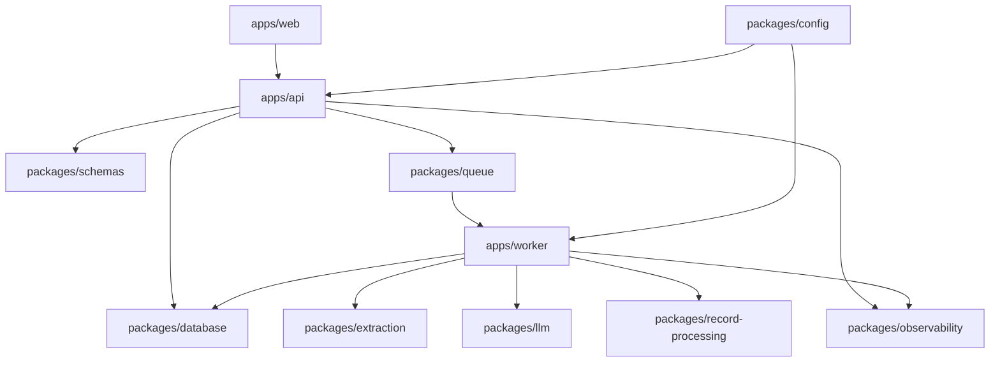

# Codebase tour

SignalForge is a pnpm workspace with deployable applications under `apps` and
reusable boundaries under `packages`. This guide explains how a request moves
through the system and where contributors should make changes.

## Mental model



- **Apps compose behavior.** They own process startup, HTTP presentation, and
  worker orchestration.
- **Packages own boundaries.** They expose focused, reusable contracts without
  depending on application code.
- **Schemas cross processes.** API payloads, queue messages, and persistence
  shapes are validated at runtime.
- **PostgreSQL is durable state.** Redis coordinates work but is not the source
  of truth for research results.

## Applications

### `apps/api`

The Fastify API validates requests, persists research-job intent, enqueues
asynchronous work, exposes status and results, and serves OpenAPI, health, and
metrics endpoints.

Start reading:

- `src/index.ts` — environment loading, dependencies, startup, shutdown.
- `src/app.ts` — Fastify construction, routes, OpenAPI, errors, metrics.
- `src/service.ts` — research-job use cases and public URL validation.

Tests live beside the implementation. Route behavior belongs in `app.test.ts`;
service behavior belongs in `service.test.ts`.

### `apps/worker`

The worker consumes typed BullMQ stages and coordinates extraction, LLM
processing, persistence, retries, failure isolation, heartbeat, and metrics.

Start reading:

- `src/index.ts` — runtime composition and concrete adapters.
- `src/runtime.ts` — BullMQ worker creation and payload assertions.
- `src/pipeline.ts` — stage transitions and failure policy.
- `src/llm-processors.ts` — content preparation and record processing.
- `src/metrics-server.ts` — worker health and Prometheus endpoints.

The pipeline stages are:

```text
research.orchestrate
  → source.fetch
  → content.extract
  → record.process
  → source terminal state
  → research job terminal state
```

### `apps/web`

The Next.js application creates research jobs, polls status, presents progress
and errors, displays validated results, and exports loaded results as CSV.

Start reading:

- `app/layout.tsx` and `app/globals.css` — shared shell and visual system.
- `app/page.tsx` — research-job creation form.
- `app/research-jobs/[jobId]/research-job-details.tsx` — polling, retry,
  progress, results, and CSV.
- `app/api/research-jobs/**` — same-origin proxy routes.
- `lib/api.ts` — upstream API request helper.

The browser calls the Next.js proxy, and the proxy calls the Fastify API using
`SIGNALFORGE_API_URL`. Keep provider credentials and backend-only configuration
out of client components.

## Shared packages

### `packages/config`

Owns startup-time Zod validation and defaults for API, worker, extraction,
queue, LLM, logging, and data-service variables.

When adding an environment variable:

1. add it to the schema;
2. add tests;
3. add it to `.env.example`;
4. wire it through Docker or deployment documentation where needed.

### `packages/database`

Owns the Prisma schema, generated client boundary, migrations, repositories,
transactions, validation, and research progress calculation.

Application routes and workers should use repositories rather than issuing
unrelated Prisma queries directly.

Key locations:

- `prisma/schema.prisma`
- `prisma/migrations`
- `src/repositories`
- `src/progress.ts`
- `src/validation`

### `packages/extraction`

Owns the controlled public-web boundary:

- URL and IP policy;
- robots handling;
- bounded HTTP requests and redirects;
- HTML readability extraction;
- concurrency and per-domain delay;
- Playwright fallback;
- extraction result contracts.

Security controls in this package are not optional conveniences. Any proposal to
relax them needs explicit tests and security review.

### `packages/llm`

Owns the provider interface, OpenAI-compatible implementation, bounded chunking,
prompts, extraction validation, evidence checks, and test fake.

LLM output is untrusted. Provider success does not imply a valid SignalForge
record; schema, source, evidence, and mention checks still apply.

### `packages/observability`

Owns Pino logger construction, redaction, and Prometheus-compatible metrics.
Keep metric labels bounded and never place source text, secrets, or unbounded
IDs in labels.

### `packages/queue`

Owns queue names, Zod payload contracts, deterministic IDs, retry and retention
options, queue publishing, Redis clients, dead-letter context, and worker
heartbeat.

Change queue producers and consumers together. Keep jobs idempotent because
retries and stalled-job recovery can repeat delivery.

### `packages/record-processing`

Owns deterministic hiring-signal normalization, deduplication, conflict
detection, attribution merging, and explainable relevance scoring.

Start reading:

- `src/types.ts` — processing contracts.
- `src/normalization.ts` — canonical values and keys.
- `src/scoring.ts` — explainable score components.
- `src/pipeline.ts` — merge, conflict, and processing flow.
- `src/record-processing.test.ts` — behavioral examples.

This is a good package for a first backend contribution because most behavior is
pure, deterministic, and unit-testable.

### `packages/schemas`

Owns shared runtime contracts:

- `src/api.ts` — HTTP request and response schemas;
- `src/persistence.ts` — stored extraction shapes;
- `src/index.ts` — public package exports.

If a shape crosses a process boundary, it likely belongs here or in the queue
package rather than as a duplicated TypeScript interface.

## End-to-end request trace

For a research-job creation request:

1. `apps/web/app/page.tsx` submits to the web proxy.
2. `apps/web/app/api/research-jobs/route.ts` forwards to Fastify.
3. `apps/api/src/app.ts` validates the HTTP contract.
4. `apps/api/src/service.ts` validates source URLs and creates the use-case
   request.
5. `packages/database` transactionally creates the job and sources.
6. `packages/queue` publishes deterministic orchestration work.
7. `apps/worker/src/pipeline.ts` moves each source through fetch, extraction,
   and processing stages.
8. `packages/extraction` retrieves controlled public content.
9. `packages/llm` turns content into validated candidate records.
10. `packages/record-processing` normalizes, merges, flags, and scores.
11. `packages/database` persists records and progress.
12. The web details page polls the API and renders results.

Use this trace to find the boundary where a bug originates before editing.

## Test layout

Most unit tests are colocated as `*.test.ts`:

```text
apps/**/src/*.test.ts
packages/**/src/*.test.ts
```

Cross-workspace and infrastructure tests are under `tests`:

- `tests/workspace.test.ts` — workspace invariants;
- `tests/database.integration.test.ts` — isolated PostgreSQL behavior;
- `packages/queue/src/redis.integration.test.ts` — isolated Redis behavior.

Vitest aliases package imports directly to their TypeScript entrypoints. Run a
focused file with:

```bash
pnpm vitest run path/to/file.test.ts
```

## Common change recipes

### Add an API field

Update the shared schema, API service and route, persistence mapping if needed,
OpenAPI response, web consumer, tests, and examples. Treat it as a contract
change even when TypeScript makes compilation errors obvious.

### Add a pipeline stage

Start with an issue or ADR. Define the queue contract and deterministic ID,
repository state transition, worker processor and failure policy, metrics,
timeouts, integration behavior, and operational documentation.

### Improve extraction

Add a sanitized fixture, reproduce the behavior in a focused test, retain URL
and resource limits, prefer the static path, and use Playwright only when
necessary.

### Change scoring

Keep the score explainable, add table-driven cases, verify normalization
interactions, and document any version or ranking compatibility concern.

### Change the UI

Preserve API contracts and loading, error, partial-success, empty, retry, and
mobile states. Check keyboard focus, reduced motion, and narrow-width overflow.

## Architecture decisions

Read the ADRs in `docs/adr` before changing foundational behavior. Add a new ADR
when a decision affects multiple packages or changes an established system
boundary.
